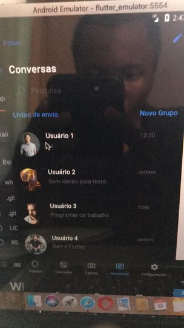
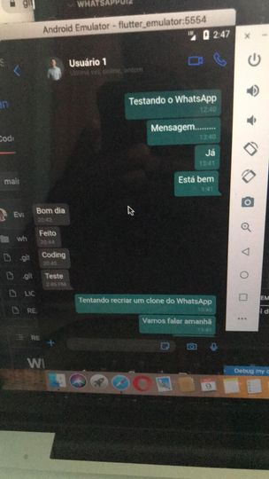

# WhatsappUI
 Redesenhando a UI do Whatsapp

#### Comandos rodar na sua maquina
  * Digitar o comando Flutter run
  * Ou digitar o comando flutter get packages.

#### Como contribuir

  + Dar um fork no projecto.
* Criar uma nova branche denominada change.
>
 * Adcionar as mudanças feitas no readme.
  >
 * dar um pull request
  

## Imagens actuais

  <a style="margin: 0 5px 0;"
  
  </a>
   
   

